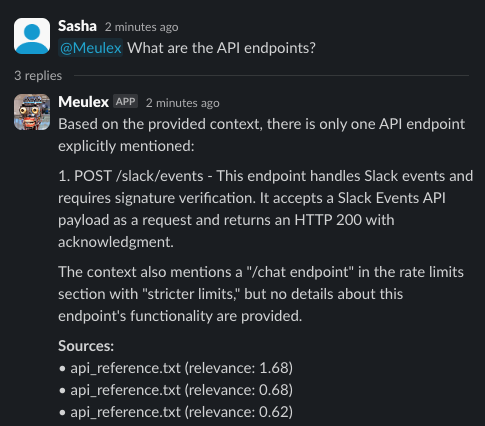

# Meulex


_heb. 'meule' (מעולה) — 'excellent'_

> Compliance‑aware, Slack‑native agentic RAG copilot boilerplate

[](https://www.python.org/downloads/)
[](https://fastapi.tiangolo.com/)
[](https://langchain-ai.github.io/langgraph/)
[](https://docker.com/)
[](LICENSE)

---

## Executive Summary

Meulex is a pragmatic, production‑friendly boilerplate for building a
compliance‑aware, Slack‑native agentic RAG copilot. It provides a minimal yet
extensible stack that can move from PoC to production quickly. The template
leans on proven building blocks and structure inspired by
[Sentio](https://github.com/chernistry/sentio-vnext) while remaining
vendor‑neutral and plug‑in friendly.

Core goals:
- Fast local bootstrap with Docker Compose (Qdrant, Redis; optional Prometheus, 
  Langfuse).
- Clean FastAPI service exposing `/chat`, `/embed`, `/slack/events`, `/health*`, 
  `/metrics`.
- LangGraph RAG pipeline: hybrid retrieval (dense + BM25 + optional RRF/rerank), 
  LLM cascade with fallback and budgets, concise citation output.
- Observability by default: OTel traces, Prometheus metrics, structured logs.
- Security first: input validation, safe logging, rate limits, headers, PII 
  masking hooks, RBAC‑ready.

Use this template to deliver a working Slack assistant in ≤5 days, then layer 
SSO, audit, and multi‑tenancy without architectural changes.

---

## Features

- Hybrid retrieval: dense (Qdrant) + sparse (BM25/Pyserini), RRF fusion.
- Optional semantic reranking via cross‑encoder (Jina) behind a feature flag.
- LLM cascade and budgets: primary provider (OpenAI‑compatible) with fallback 
  (e.g., Ollama) + circuit breakers and retries.
- Prefect ingestion flow: load → chunk → embed → upsert (idempotent, version‑
  ready).
- Slack integration: request signing verification, idempotency, ack‑first.
- Observability: OTel spans per pipeline node; Prom metrics (business + infra).
- Security baseline: validation, security headers, rate limiting, PII masking, 
  safe logging; `/metrics` guard option.
- Pluggable providers: LLM, embeddings, vector DB, rerankers via config only.

---

## Architecture Overview

### High‑Level Data Flow


### System Architecture (Mermaid)


### RAG Pipeline (Detailed)


### Core Components

- API (FastAPI): routing, validation, rate limiting, security headers, metrics.
- Orchestration (LangGraph): nodes `{retrieve → (rerank?) → select → generate}`.
- Ingestion (Prefect): directory/file → chunk → embed (batch) → upsert.
- Retrieval: hybrid retriever with domain scorers (keyword, recency, MMR).
- LLM: provider registry + cascade + prompt builder + optional streaming.
- Vector store: Qdrant adapter (sync for simplicity, async for scale later).
- Embeddings: Jina provider with batching, retries and caching hooks.
- Caching: multi‑tier L1/L2 (memory + Redis), semantic cache keys.
- Observability: OTel tracing, Prometheus metrics, structured JSON logs.
- Security: validation, headers, rate limits, PII masking, RBAC‑ready guards.

For deeper reference and code patterns, see `langgraph/src/**` in this repo. 
Borrow minimal code where helpful; keep Meulex modules lean and focused.

---

## Quick Start

### Prerequisites

- Python 3.12+
- Docker & Docker Compose
- API keys (optional at start): OpenAI‑compatible, Jina; Slack signing secret

### Configuration

```bash
cp .env.example .env
# Edit LLM/embeddings/vector settings as needed
```

Key environment variables (excerpt):

| Name | Description |
|------|-------------|
| LLM_PROVIDER | e.g., `openai` (primary) |
| LLM_MODEL | e.g., `gpt-4o-mini` |
| LLM_BASE_URL | OpenAI‑compatible endpoint |
| LLM_API_KEY | API key for LLM provider |
| EMBEDDER_NAME | e.g., `jina` |
| JINA_API_KEY | API key for embeddings |
| VECTOR_STORE | `qdrant` |
| QDRANT_URL | e.g., `http://localhost:6333` |
| REDIS_URL | e.g., `redis://localhost:6379/0` |
| FEATURE_FLAGS | path to YAML with toggles |
| SLACK_SIGNING_SECRET | Slack verification secret |

### Run (Docker Compose)

```bash
docker compose up -d
uvicorn meulex.api.app:app --host 0.0.0.0 --port 8000 --reload
```

Verify:

```bash
curl -s http://localhost:8000/health | jq .
```

### Alternative Quick Start (CLI)

```bash
# Install (editable) and start infra
pip install -e .
docker compose up -d

# Start API via CLI
meulex api --host 0.0.0.0 --port 8000

# Ingest content
meulex ingest_file ./test_data/doc1.md
meulex ingest_directory ./test_data/
```

> Slack setup: see detailed step-by-step guide in `docs/setup_slack.md`.

### Ingesting Documents

You can ingest files in three ways. Pick what fits your setup.

1) Via API (no container access required)

```bash
for f in /Users/sasha/IdeaProjects/meulex/test_data/*; do \
  jq -Rs --arg id "$(basename "$f")" '{id:$id, content:., metadata:{source:$id}}' "$f" \
  | curl -sS -X POST http://localhost:8000/embed \
    -H 'Content-Type: application/json' -d @-; echo; \
done
```

2) CLI from host (when Qdrant port is reachable)

```bash
export QDRANT_URL=http://localhost:6333
meulex ingest_directory /Users/sasha/IdeaProjects/meulex/test_data --collection meulex_docs
```

3) Inside container (service `meulex-api`)

```bash
CID=$(docker compose ps -q meulex-api)
docker cp /Users/sasha/IdeaProjects/meulex/test_data "$CID":/app/test_data
docker compose exec meulex-api sh -lc \
  "python -m meulex.cli.main ingest_directory /app/test_data --collection meulex_docs"
```

Verify ingestion and retrieval:

```bash
curl -s http://localhost:8000/health | jq .
curl -s -X POST http://localhost:8000/chat -H 'Content-Type: application/json' \
  -d '{"question":"What is Meulex?"}' | jq .
```

---

## Screenshots

<p>
  
</p>

<p>
  
</p>

### CLI (Typer)

```bash
python -m meulex.cli.main ingest directory ./docs --collection meulex_docs
python -m meulex.cli.main ingest file ./docs/intro.md
python -m meulex.cli.main api start --host 0.0.0.0 --port 8000
```

---

## API Reference (excerpt)

### Endpoints and default rate limits

| Endpoint | Method | Description | Default limit* |
|----------|--------|-------------|----------------|
| `/health` | GET | Health check | none |
| `/info` | GET | Service information | 60/min |
| `/metrics` | GET | Prometheus metrics | token‑guarded |
| `/embed` | POST | Document ingestion | 20/min |
| `/chat` | POST | RAG chat completion | 10/min |
| `/slack/events` | POST | Slack Events API | 100/min |

*Actual limits are configurable via settings.

### POST /chat

Request:

```json
{
  "question": "What is Meulex?",
  "history": [{"role":"user","content":"..."}],
  "top_k": 3,
  "temperature": 0.7
}
```

Response:

```json
{
  "answer": "...",
  "sources": [
    {"text": "...", "source": "doc1.md", "score": 0.87}
  ],
  "metadata": {"processing_time": 0.93, "model_used": "gpt-4o-mini"}
}
```

### POST /embed

Request:

```json
{ "id": "doc-001", "content": "# Intro...", "metadata": {"source": "md"} }
```

Response: `{ "status": "ok", "count": 12, "ids": ["..."] }`

### GET /health, /health/ready, /health/live

Basic and dependency health summaries.

### GET /metrics

Prometheus exposition; optionally token‑guarded.

### POST /slack/events

Slack Events API endpoint; verifies signature/timestamp; idempotent handling.

#### Slack Events Flow (Sequence)


---

## Ingestion Pipeline (Prefect)

- Load directory/file → Chunk (recursive splitter; default 512/64) → Embed 
  (batched) → Upsert to Qdrant (idempotent).
- Batch sizes and concurrency tuned via config; retries with jitter.
- Emits OTel spans and Prometheus metrics per stage.

---

## Retrieval & Generation

- Dense search with Qdrant; sparse BM25 (or Pyserini) optional.
- Reciprocal Rank Fusion (RRF) merges scores; weights configurable.
- Optional reranker (Jina) gated by feature flag with circuit breaker + retry.
- Prompt builder assembles concise context with token budget enforcement.
- Cascade: primary LLM (OpenAI‑compatible) → fallback (Ollama/mock) on timeout 
  or breaker open; budgets tracked with metrics.

---

## Observability

Metrics (examples):
- `rag_requests_total{endpoint,method,status,provider}`
- `rag_request_duration_seconds_bucket`
- `rag_cache_hits_total{type,result}`
- `rag_embeddings_generated_total{model,provider}`
- `rag_documents_retrieved_total{strategy}`
- `llm_tokens_total{provider}` / `llm_cost_cents_total{provider}`

Tracing:
- Spans for API middleware, retriever/reranker/selector/generator nodes, and 
  ingestion stages. Correlate with request IDs in logs.

Logging:
- Structured JSON; secrets masked; include `request_id`, endpoint, duration.

---

## Security Baseline

- Input validation with Pydantic; payload size limits; strict types.
- Security headers (CSP, X‑Content‑Type‑Options, Referrer‑Policy, etc.).
- Rate limits per route; stricter on `/chat` and `/slack/events`.
- Slack signing verification (timestamp drift window; constant‑time compare).
- PII masking hooks for outputs and logs.
- `/metrics` and destructive ops can be guarded by token or local‑only.

Next steps (production): OIDC/JWT, SCIM, audit sink, DLP enhancements, tenant 
isolation at storage and config layers.

---

## Configuration Guide

Feature flags (YAML example):

```yaml
retrieval:
  enable_hybrid: true
  enable_reranker: false
llm:
  enable_streaming: false
observability:
  tracing: true
  metrics: true
```

Provider selection via env (no code changes):

```bash
LLM_PROVIDER=openai
LLM_MODEL=gpt-4o-mini
EMBEDDER_NAME=jina
VECTOR_STORE=qdrant
```

### Environment variables (extended)

```bash
# Core
LOG_LEVEL=INFO
ENVIRONMENT=development

# LLM
LLM_PROVIDER=openai
OPENAI_API_KEY=sk-...
FALLBACK_LLM_PROVIDER=ollama
TEMPERATURE=0.7

# Embeddings
EMBEDDER_NAME=jina
JINA_API_KEY=jina_...

# Vector DB
QDRANT_URL=http://localhost:6333
QDRANT_API_KEY=

# Caching
ENABLE_CACHE=true
REDIS_URL=redis://localhost:6379

# Retrieval
ENABLE_SPARSE_RETRIEVAL=true
ENABLE_RERANKER=false
DEFAULT_TOP_K=3

# Security
ENABLE_RATE_LIMITING=true
ENABLE_SECURITY_HEADERS=true
ENABLE_LOG_SANITIZATION=true
METRICS_TOKEN=

# Slack
SLACK_BOT_TOKEN=xoxb-...
SLACK_SIGNING_SECRET=...
SLACK_BOT_USER_ID=U123...
```

---

## Testing

Run tests:

```bash
pytest -q
```

What to expect:
- Unit: cascade fallbacks, hybrid RRF math, embeddings batching, PII masking, 
  error contracts.
- Integration: ingest → chat round‑trip (≥1 citation), Slack signature, metrics 
  presence, traces created (mock tracer).

Quality:
- 88‑char line length; ≥85% type hints on public APIs; Google‑style docstrings.

### Evaluation (CLI)

```bash
# Human‑readable output
meulex eval --format pretty

# Save JSON results
meulex eval --output results.json

# Use real providers (requires API keys)
meulex eval --mock false
```

---

## Project Structure (suggested)

```
meulex/
├── api/                     # FastAPI app and routes
├── orchestrator/
│   ├── graphs/              # LangGraph DAGs
│   └── flows/               # Prefect flows (ingestion)
├── core/
│   ├── embeddings/          # Base + provider factories
│   ├── retrievers/          # Dense/Sparse/Hybrid + scorers
│   ├── rerankers/           # Optional rerankers
│   ├── vector/              # Qdrant adapters
│   └── caching/             # Cache manager, memory/Redis
├── llm/                     # Providers and cascade
├── observability/           # OTel + Prometheus
├── security/                # PII, policies, guards
├── config/                  # Pydantic settings + flags
├── cli/                     # Typer CLI entry points
└── tests/                   # Unit/Integration tests
```

---

## Deployment

### Docker

```bash
# Build image
docker build -t meulex:latest .

# Run with compose
docker compose up -d

# Scale API
docker compose up -d --scale api=3
```

### Kubernetes (example)

```yaml
apiVersion: apps/v1
kind: Deployment
metadata:
  name: meulex-api
spec:
  replicas: 3
  selector:
    matchLabels:
      app: meulex-api
  template:
    metadata:
      labels:
        app: meulex-api
    spec:
      containers:
      - name: meulex
        image: meulex:latest
        ports:
        - containerPort: 8000
        env:
        - name: REDIS_URL
          value: "redis://redis-service:6379"
        - name: QDRANT_URL
          value: "http://qdrant-service:6333"
```

### Production checklist

- [ ] Configure real API keys (OpenAI/Jina)
- [ ] Redis for distributed cache
- [ ] Prometheus scraping and dashboards
- [ ] Log aggregation (ELK/Datadog)
- [ ] Reverse proxy + TLS
- [ ] Vector data backup strategy
- [ ] Alerts for critical metrics

---

## Contributing

1. Fork the repository
2. Create a feature branch
3. Add tests for new functionality
4. Ensure all tests pass
5. Update documentation
6. Open a pull request

---

## Additional Resources

- LangGraph, LangChain, Qdrant, FastAPI (see their docs)
- Local links when running:
  - API Docs: http://localhost:8000/docs
  - Metrics: http://localhost:8000/metrics
  - Health: http://localhost:8000/health

## Roadmap (v2+)

- SSO (OIDC), SCIM; org/tenant isolation and quotas.
- Action tools via MCP (Jira/Zendesk/Salesforce) with policy dry‑run and audit.
- Vector store adapters for Weaviate/OpenSearch; ranking plugins.
- Hallucination/citation verifiers; regression sets and dashboards (Langfuse).
- K8s manifests and GitOps overlays; autoscaling with custom metrics.

---

## Acknowledgements

- Structure and patterns inspired by [Sentio](https://github.com/chernistry/sentio-vnext).
- Thanks to OpenAI/Ollama/Jina/Qdrant communities for high‑quality tooling.

---

## License

Creative Commons Attribution‑NonCommercial 4.0 International (CC BY‑NC 4.0).
See `LICENSE`.
